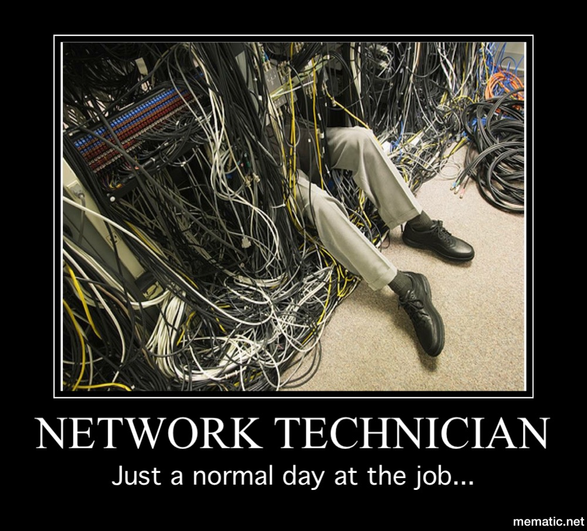

# B1 Réseau 2024

Ici il y aura tous les supports de cours liées aux sessions réseau B1.

## [TP](./tp/README.md)

- [**TP1** : Les premiers pas de bébé B1](./tp/1/README.md)
- [**TP2** : Hey yo tell a neighbor tell a friend](./tp/2/README.md)
- [**TP3** : 32°13'34"N 95°03'27"W](./tp/3/README.md)
- [**TP4** : DHCP et accès internet](./tp/4/README.md)
- [**TP5** : Un ptit LAN à nous](./tp/5/README.md)
- [**TP6** : Des bo services dans des bo LANs](./tp/6/README.md)
- [**TP7** : On dit chiffrer pas crypter](./tp/7/README.md)

## [Cours](./cours/README.md)

- [Adresses MAC](./cours/mac_address/README.md)
- [Protocole ARP](./cours/arp/README.md)
- [Notions de ports (TCP et UDP)](./cours/tcp_udp/README.md)
- [Serveur DHCP](./cours/dhcp/README.md)

## [Mémos](./cours/memo/README.mds)

- [Mémo réseau Ubuntu](./cours/memo/ubuntu.md)
- [Mémo réseau Rocky](./cours/memo/rocky.md)

