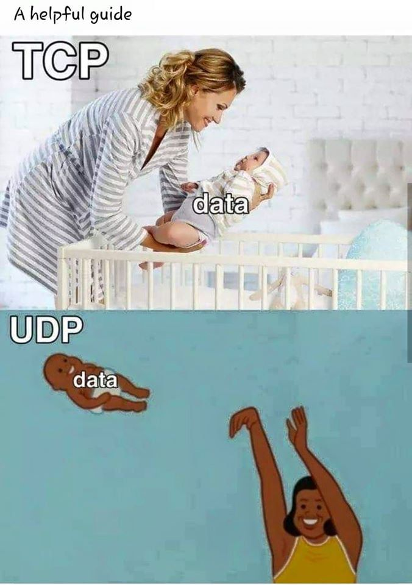
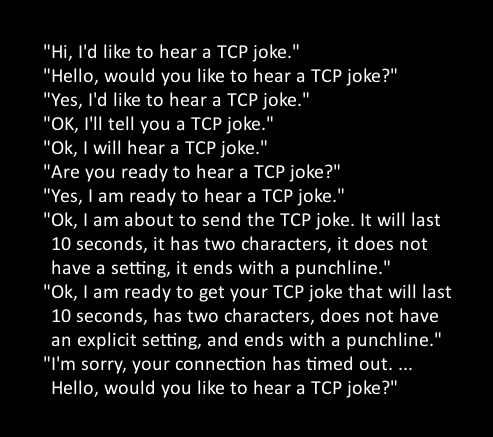
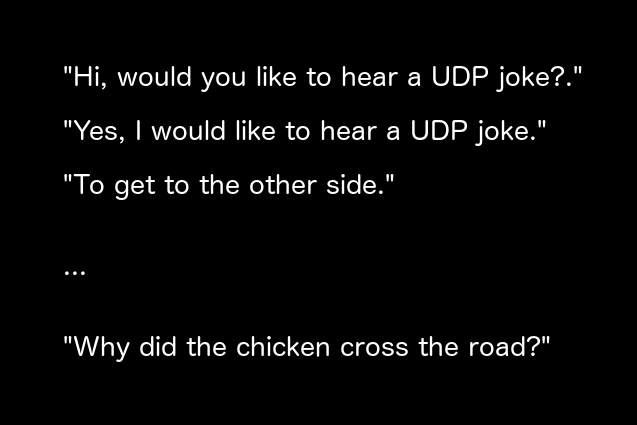

# TCP et UDP

**Dans ce cours on va explorer les protocoles TCP et UDP, c'est à dire la notion de ports.**

Une fois qu'on sait mettre des machines en réseau local (protocole Ethernet : les MAC) et qu'on sait connecter des LANs entre eux (protocole IP + routage), ça serait bien de faire un peu plus que s'envoyer des pings.

**Une fois qu'on est donc capables de joindre l'IP de notre correspondant, on va utiliser les ports afin de permettre un échange de données avec lui.**

La plupart des échanges de données entre deux machines douées d'une IP sont généralement initiées par une machine qui se connecte à une autre.

➜ **On appelle la machine qui initie la connexion un client.**  
➜ **On appelle la machine qui attend de recevoir des connexions un serveur.**

# Sommaire

- [TCP et UDP](#tcp-et-udp)
- [Sommaire](#sommaire)
- [I. Notion de port](#i-notion-de-port)
  - [1. Intro](#1-intro)
  - [2. Client et serveur](#2-client-et-serveur)
  - [3. Segment](#3-segment)
  - [4. Firewall](#4-firewall)
- [II. TCP et UDP](#ii-tcp-et-udp)
  - [1. Choisir](#1-choisir)
  - [2. TCP](#2-tcp)
    - [A. Les différents types de messages TCP](#a-les-différents-types-de-messages-tcp)
      - [a. Etablissement de connexion](#a-etablissement-de-connexion)
      - [b. Envoi de message](#b-envoi-de-message)
      - [c. Accusés de réception](#c-accusés-de-réception)
      - [d. Fin de connexion](#d-fin-de-connexion)
    - [B. Autres caractéristiques](#b-autres-caractéristiques)
      - [a. Contrôle de flux](#a-contrôle-de-flux)
      - [b. Contrôle d'intégrité](#b-contrôle-dintégrité)
  - [3. UDP](#3-udp)

# I. Notion de port

## 1. Intro

➜ **Un port d'une machine permet de se connecter au port d'une autre machine afin d'échanger des données.**

Plus précisément, les ports sont sur chaque interface réseau de chaque machine. Il existe 65535 ports TCP et 65535 ports UDP sur chaque interface réseau.

Une analogie très juste est de se représenter chaque port comme une porte. Chaque porte est munie d'un type (TCP ou UDP) et d'un numéro (de 1 à 65536). Ca fait beaucoup de portes je sais n_n

➜ **Lorsque deux machines qui se connectent en utilisant des ports,  on dit que :**

- chaque machine a un port "ouvert" et ce port est connecté au port de l'autre machione
- on dit qu'il existe un "tunnel" de communication qui est "établi" lorsque deux machines communiquent avec des ports

## 2. Client et serveur

Les connexions de ports sont donc établies entre les les interfaces de deux machines.

Généralement, on appelle une des deux machines le client et l'autre le serveur.

➜ **On appelle la machine qui initie la connexion un client.**  

Le *client* utilise un logiciel adapté (comme un navigateur Web pour visiter un site web) qui permet d'ouvrir un port et de sec connecter à une autre machine (le *serveur*).

> On appelle "client" la machine qui effectue la connexion. Souvent on appelle aussi "client" le logiciel qui sert à ouvrir un port et initier une connexion. Ainsi un navigateur web peut aussi être appelé un *client web*.

**Le *client* connaît à l'avance l'IP et le port du serveur auxquels il souhaite se connecter.**

> Dans le cas d'une visite d'un site web, l'IP est associée au nom de domaine (que le client connaît ou trouve dans un moteur de recherche), et le port est par convention 443/TCP pour de l'HTTPS. Dans le cas d'un jeu en ligne, le logiciel lancé par le joueur contient à l'avance l'IP et le port nécessaire pour se connecter au serveur de jeu.

➜ **On appelle la machine attend de recevoir des connexions un *serveur*.**

Le *serveur* a pour unique de tâche d'attendre la connexion des *clients*. Dans cette optique, il ouvre un port et attend que des *clients* se connectent dessus.

**Lorsqu'un *serveur* ouvre un port et attend la connexion de *clients*, on dit qu'il *écoute* sur ce port.**

> On appelle *serveur* une machine exécutant des applications qui attendent la connexion de clients. On appelle aussi "serveur" ou "service" l'application qui écoute sur le port. Nous utiliserons le terme "service" pour désigner cette application dans la suite du document, afin de le distinguer du terme "serveur".

## 3. Segment

➜ **On appelle *segment* (ou *datagramme*) un message TCP ou UDP** qui est envoyé dans un tunnel de communication établi entre deux machines (un client et un serveur généralement).

Le *segment* possède un port source et un port destination.

Le *segment* est de type TCP ou UDP, et il est placé à l'intérieur du paquet IP.

Ainsi :

- quand une machine reçoit un paquet IP, elle l'ouvre afin de découvrir un *segment*
- ce *segment* a un port de destination
- la machine fait passer le *segment* à la bonne application : celle qui a ouvert ce port

## 4. Firewall

Un *firewall* (ou *pare-feu* en français) est une application qui tourne sur la plupart des machines (clients comme serveurs).

➜ **Le *firewall* a pour rôle de bloquer ou laisser passer certaines connexions réseau** en fonction de critères définis par l'administrateur de la machine. Ses principaux critères sont :

- l'IP source de chaque paquet
- l'IP de destination de chaque paquet
- le port source de chaque segment
- le port destination de chaque segment

Ainsi, même si une application écoute sur un port sur un *serveur* donné, alors les *clients* peuvent être bloqués à la connexion par le *firewall*.

# II. TCP et UDP

Oooooook mais donc, c'est quoi *TCP* et *UDP* ? La diff entre les deux ? Lequel on doit choisir dans quel contexte ?

## 1. Choisir

➜ **L'admin qui lance l'application qui écoute sur un port côté serveur choisit si l'application écoute sur un port de type *TCP* ou *UDP***

Ainsi, les clients **devront** se connecter à ce port spécifique afin d'accéder au service.

**Cet admin choisira le numéro de port :**

- de façon complètement arbitraire
- par convention, certains protocoles ont un port réservé, par exemple
  - 80/TCP pour HTTP
  - 443/TCP pour HTTPS
  - 22/TCP pour SSH

**Cet admin choisira un port de type *TCP* ou *UDP*** en fonction de ce qu'il souhaite pour son application. Nous allons détailler dans les parties suivantes les caractéristiques de chacun des deux dans les parties dédiées qui suivent.

Voici, de façon concise, les caractéristiques des deux, en fonction desquelles l'admin va choisir l'un ou l'autre, *TCP* ou *UDP* :

- ***TCP* est fiable mais lent**
  - le plus utilisé
  - primordial pour de l'HTTPS par exemple
- ***UDP* est rapide mais pas fiable**
  - moins utilisé
  - très utilisé dans certains cadres qui nécessitent avant tout de la vitesse (streaming, jeux en ligne, etc.)

**Aucun n'est mieux que l'autre. Ca dépend du contexte.**

## 2. TCP

TCP est un protocole qui s'assure que tout se passe bien lors d'une connexion :

- que les messages ne sont pas altérés
- que aucun message ne manque dans l'échange
- que les messages sont traités dans l'ordre

### A. Les différents types de messages TCP

#### a. Etablissement de connexion

Lorsqu'un client se connecte à un serveur :

- le client envoie un `SYN` au serveur
- le serveur répond un `SYN ACK`
- le client répond à son tour un `ACK`

On appelle cet échange le 3-way handshake.

Une fois le 3-way handshake réalisé, le client et le serveur peuvent échanger des données.

#### b. Envoi de message

Lorsque l'une des deux parties envoie un message à l'autre, elle envoie un `PSH` qui contient les données utiles.

Celui qui reçoit un `PSH` répond un `PSH ACK` à son correspondant afin d'indiquer qu'il a reçu le `PSH`

#### c. Accusés de réception

De façon générale, à chaque fois que l'une des deux parties reçoit un message, celui qui reçoit répond un `ACK` afin d'indiquer qu'il a bien reçu le message.

#### d. Fin de connexion

Lorsque le client ou le serveur souhaite mettre fin à la connexion, il envoie un `FIN` à son correspondant.

Le correspondant pourra alors répondre un `FIN ACK` pour terminer proprement la connexion.

### B. Autres caractéristiques

#### a. Contrôle de flux

Chaque *segment TCP* contient un numéro de séquence. A chaque *segment TCP* envoyé, le numéro de séquence est incrémenté de 1.

Ce numéro de séquence permet de déterminer l'ordre des messages et ainsi maintenir le *flux* de l'échange.

#### b. Contrôle d'intégrité

Chaque *segment TCP* contient un *checksum*. C'est une valeur calculée par l'emetteur du message à partir du contenu du message.

Lorsqu'un *segment TCP* est reçu par une machine, la machine calcule de nouveau ce *checksum* en utilisant le contenu du message.  
Si le *checksum* calculé par le récepteur est le même que celui qui est stocké dans le *segment*, alors le *segment* n'a à priori pas été modifié.

## 3. UDP

**UDP c'est simple : il ne fait rien de ce que fait TCP.**

**On envoie simplement de la donnée brute en ouvrant un port, vers un port de destination.**

Pas d'établissement de connexion, pas de fin de connexion, pas d'accusé de réception, etc.

