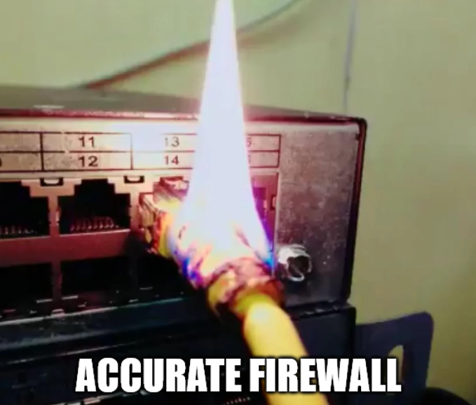
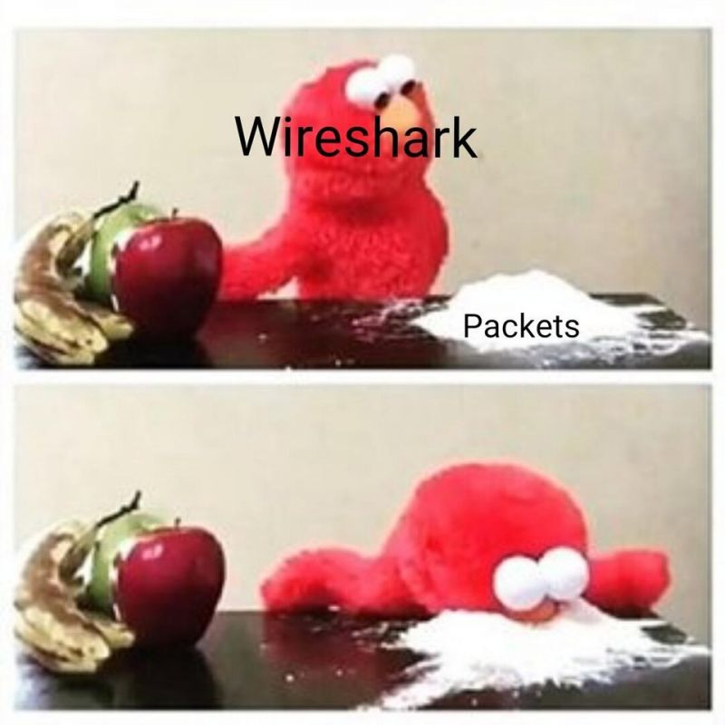

# TP1 : Les premiers pas de bébé B1

Dans ce premier TP de réseau, on va partir de ce que vous avez l'habitude de manipuler : votre PC.

On commence très doucement avec au menu, en vrac :

- des **commandes dans le terminal**
- faire joujou avec **les cartes réseau** de votre PC
- commencer à appréhender comment votre PC interagit avec le réseau
- se familiariser peu à peu avec des outils usuels du réseau, comme le `ping` et Wireshark


## Sommaire

- [TP1 : Les premiers pas de bébé B1](#tp1--les-premiers-pas-de-bébé-b1)
  - [Sommaire](#sommaire)
- [0. Prérequis](#0-prérequis)
- [I. Récolte d'informations](#i-récolte-dinformations)
- [II. Utiliser le réseau](#ii-utiliser-le-réseau)
- [III. Sniffer le réseau](#iii-sniffer-le-réseau)
- [IV. Network scanning et adresses IP](#iv-network-scanning-et-adresses-ip)

# 0. Prérequis

- ton PC
- connecté à un réseau local (celui de l'école, celui de chez vous, peu importe)
- ce réseau local permet un accès internet
- tu sais ouvrir un terminal sur ton PC

> *Petite précision pour les Windowsiens : le terminal s'appelle Powershell (n'ouvrez pas l'antiquité qu'est CMD ou "Invite de commandes", c'était en 2002 ça).*

# I. Récolte d'informations

> Pour rappel, tout est à faire depuis un terminal, sauf si je mentionne explicitement le contraire.

🌞 **Adresses IP de ta machine**

- affiche l'adresse IP que ta machine a sur sa carte réseau WiFi:
  ```powershell
  PS C:\Users\Ulyss_zi> ipconfig /all
  Carte réseau sans fil Wi-Fi :


   Adresse IPv4. . . . . . . . . . . . . .: 10.33.78.139(préféré)
   ````

  
  

- affiche l'adresse IP que ta machine a sur sa carte réseau ethernet
  - tu mets rien si t'as pas de carte Ethernet (parce que t'es le démon et t'as un Mac)

🌞 **Si t'as un accès internet normal, d'autres infos sont forcément dispos...**

- affiche l'adresse IP de la passerelle du réseau local:
    ```powershell
    PS C:\Users\Ulyss_zi> ipconfig /all
    Carte réseau sans fil Wi-Fi :


      Passerelle par défaut. . . . . . . . . : 10.33.79.254
    ````

  - notez que cette IP commence par au moins les 2 même nombre que l'IP de votre carte WiFi
  - c'est obligatoire (sinon sa march pa kopin), on verra ultérieurement pourquoi
- affiche l'adresse IP du serveur DNS que connaît ton PC:
  ```powershell
    PS C:\Users\Ulyss_zi> ipconfig /all
    Carte réseau sans fil Wi-Fi :

       Serveurs DNS. . .  . . . . . . . . . . : 8.8.8.8
    ````

- affiche l'adresse IP du serveur DHCP que connaît ton PC:
  ```powershell
    PS C:\Users\Ulyss_zi> ipconfig /all
    Carte réseau sans fil Wi-Fi :

       Serveur DHCP . . . . . . . . . . . . . : 10.33.79.254
    ````

> On en reparlera en détails de ces 3 trucs dans des cours ultérieurs. J'commence à planter les graines dans vos esprits ;) Juste en passant : la *passerelle* c'est le routeur de ton réseau : celui qui accepte gentiment de faire passer tes paquets vers internet.

🌟 **BONUS** : Détermine s'il y a un pare-feu actif sur ta machine

- toujours à l'aide d'une commande dans votre terminal
- détermine s'il exise un pare-feu actif sur votre machine:
```powershell
PS C:\Users\Ulyss_zi> Get-NetFirewallProfile | ft Name,Enabled

Name    Enabled
----    -------
Domain     True
Private    True
Public     True

```
- si oui, je veux aussi voir une commande pour lister les règles du pare-feu:
```powershell 
PS C:\Users\Ulyss_zi> netsh advfirewall show allprofiles

Paramètres Profil de domaine :
----------------------------------------------------------------------
État                                  Actif
Stratégie de pare-feu                 BlockInbound,AllowOutbound
LocalFirewallRules                    N/A (magasin d’objets de stratégie de groupe uniquement)
LocalConSecRules                      N/A (magasin d’objets de stratégie de groupe uniquement)
InboundUserNotification               Activer
RemoteManagement                      Désactiver
UnicastResponseToMulticast            Activer

Journalisation :
LogAllowedConnections                 Désactiver
LogDroppedConnections                 Désactiver
FileName                              %systemroot%\system32\LogFiles\Firewall\pfirewall.log
MaxFileSize                           4096


Paramètres Profil privé :
----------------------------------------------------------------------
État                                  Actif
Stratégie de pare-feu                 BlockInbound,AllowOutbound
LocalFirewallRules                    N/A (magasin d’objets de stratégie de groupe uniquement)
LocalConSecRules                      N/A (magasin d’objets de stratégie de groupe uniquement)
InboundUserNotification               Activer
RemoteManagement                      Désactiver
UnicastResponseToMulticast            Activer

Journalisation :
LogAllowedConnections                 Désactiver
LogDroppedConnections                 Désactiver
FileName                              %systemroot%\system32\LogFiles\Firewall\pfirewall.log
MaxFileSize                           4096


Paramètres Profil public :
----------------------------------------------------------------------
État                                  Actif
Stratégie de pare-feu                 BlockInbound,AllowOutbound
LocalFirewallRules                    N/A (magasin d’objets de stratégie de groupe uniquement)
LocalConSecRules                      N/A (magasin d’objets de stratégie de groupe uniquement)
InboundUserNotification               Activer
RemoteManagement                      Désactiver
UnicastResponseToMulticast            Activer

Journalisation :
LogAllowedConnections                 Désactiver
LogDroppedConnections                 Désactiver
FileName                              %systemroot%\system32\LogFiles\Firewall\pfirewall.log
MaxFileSize                           4096

Ok.
```
- demande à google, ça tombe direct !

> Un *pare-feu* ou *firewall* est un logiciel qui filtre tous les paquets qui entrent sur une machine, mais aussi tous les paquets qui sortent. En fonction de certaines règles, le pare-feu choisira d'accepter un paquet, ou de le jeter. Une règle c'est par exemple "si ça vient de l'IP xxx.xxx.xxx.xxx alors je jette le paquet" : on peut donc par exemple blacklister une IP avec le pare-feu. L'idée du pare-feu, c'est de jeter le trafic indésirable (par exemple, une potentielle attaque). Il existe un pare-feu sur n'importe quel PC, serveur, etc.



# II. Utiliser le réseau

On va jouer avec des `ping` ici ! C'est un mot qui doit parler à tous les gamers de la promo normalement, étant une valeur que vous utilisez pour savoir si vous avez du lag réseau pendant une session geek (ou si c'est juste ton PC qui est une poubelle remplie de virus).

En réalité, `ping` est un outil qu'on se sert juste tout le temps en réseau. Un `ping` c'est un message extrêmement court et simpliste que n'importe qui peut envoyer en une commande.

> A titre informatif : `ping` est un message de type ICMP. On y reviendra.

Si une machine reçoit un `ping`, elle répond spontanément à l'émetteur avec un message tout aussi court et simpliste : appelons le `pong`.

L'utilité du truc, c'est qu'on va mesurer, en tant qu'émetteur, le temps entre l'envoi du `ping` et la réception du `pong` correspondant.

Plus le temps est long, plus le réseau rame entre notre PC et la destination !

Pour envoyer un `ping` à l'adresse IP de votre choix, ouvrez un terminal et saisissez :

```bash
# Structure de la commande
ping <ADRESSE_IP>

# Par exemple, pour envoyer un ping à l'IP 192.168.56.11 :
ping 192.168.56.11
```

> Habituez-vous à cette syntaxe, c'pas moi qui l'ai inventée, vous serez amenés à la trouver ailleurs. Si je mets un truc entre chevrons en majuscule, c'est pour indiquer que vous devez le remplacer avec quelque chose. Ici, `<ADRESSE_IP>` est à remplacer par l'adresse IP de votre choix. Non mais je précise, au cas où... :d

🌞 **Envoie un `ping` vers...**

- **toi-même !**
  - fais un `ping` vers ta propre adresse IP
  - vous devriez constater que le temps de l'aller-retour est extrêment court:
  ```powershell
  PS C:\Users\Ulyss_zi> ping 10.33.78.139

  Envoi d’une requête 'Ping'  10.33.78.139 avec 32 octets de données :
  Réponse de 10.33.78.139 : octets=32 temps<1ms TTL=128
  Réponse de 10.33.78.139 : octets=32 temps<1ms TTL=128
  Réponse de 10.33.78.139 : octets=32 temps<1ms TTL=128
  Réponse de 10.33.78.139 : octets=32 temps<1ms TTL=128

  Statistiques Ping pour 10.33.78.139:
      Paquets : envoyés = 4, reçus = 4, perdus = 0 (perte 0%),
  Durée approximative des boucles en millisecondes :
      Minimum = 0ms, Maximum = 0ms, Moyenne = 0ms

  ```
- **vers l'adresse IP `127.0.0.1`**
  - tu devrais constater un temps très court encore
  - c'est une adresse IP un peu particulière, on l'appelle **adresse de loopback**
  - ça permet à un PC de se joindre lui-même
  - peu importe depuis quel PC, si tu contactes `127.0.0.1` (avec un `ping` comme ici par exemple), ça envoie le paquet vers le PC lui-même !
  - tu verras plus tard que c'est très utile... on se contente d'un ping pour le moment !:
  ```
  PS C:\Users\Ulyss_zi> ping 127.0.0.1

    Envoi d’une requête 'Ping'  127.0.0.1 avec 32 octets de données :
    Réponse de 127.0.0.1 : octets=32 temps<1ms TTL=128
    Réponse de 127.0.0.1 : octets=32 temps<1ms TTL=128
    Réponse de 127.0.0.1 : octets=32 temps<1ms TTL=128
    Réponse de 127.0.0.1 : octets=32 temps<1ms TTL=128

    Statistiques Ping pour 127.0.0.1:
        Paquets : envoyés = 4, reçus = 4, perdus = 0 (perte 0%),
    Durée approximative des boucles en millisecondes :
        Minimum = 0ms, Maximum = 0ms, Moyenne = 0ms
  ```


> Ces `ping` ont des temps très courts car ils ne sortent jamais de votre machine. En effet, quand tu te `ping` toi-même, le message n'est jamais envoyé dans un câble. Ce serait un peu con non ? Puisque tu envoies un message toi-même... Quand tu parles tout seul, tu le fais à voix haute, tu t'envoies pas une lettre par la poste, si ?!

🌞 **On continue avec `ping`.** Envoie un `ping` vers...

- **ta passerelle**
  - t'as repéré son adresse IP dans la première partie
  - soyez attentifs au temps d'aller-retour:
  ```powershell
  PS C:\Users\Ulyss_zi> ping  10.33.79.254

  Envoi d’une requête 'Ping'  10.33.79.254 avec 32 octets de données :
  Délai d’attente de la demande dépassé.
  Délai d’attente de la demande dépassé.
  Délai d’attente de la demande dépassé.
  Délai d’attente de la demande dépassé.

  Statistiques Ping pour 10.33.79.254:
      Paquets : envoyés = 4, reçus = 0, perdus = 4 (perte 100%),
   ```

- **un(e) pote sur le réseau**
  - demande l'adresse IP de quelqu'un qui est connecté au même réseau local que toi, là, tout de suite
  - fais un `ping` vers son adresse IP
  - vous devriez constater un temps similaire à celui de la passerelle
  ```powershell
    C:\Windows\System32>ping 10.7.1.254

  Envoi d’une requête 'Ping'  10.7.1.254 avec 32 octets de données :
  Réponse de 10.7.1.254 : octets=32 temps=2 ms TTL=64
  Réponse de 10.7.1.254 : octets=32 temps<1ms TTL=64
  Réponse de 10.7.1.254 : octets=32 temps<1ms TTL=64
  Réponse de 10.7.1.254 : octets=32 temps<1ms TTL=64

  ```
  - si le `ping` marche pas, je parie que ton pote est sous Windows. Par défaut, le pare-feu de Windows bloque les message `ping` qu'il reçoit, il faudra temporairement le désactiver
- **un site internet**
  - fais un `ping` vers un site que tu connais
  - par exemple `ping www.thinkerview.com`
  - vous devriez constater que le temps est plus long:
  ```powershell
  C:\Windows\System32>ping google.com

  Envoi d’une requête 'ping' sur google.com [216.58.214.78] avec 32 octets de données :
  Réponse de 216.58.214.78 : octets=32 temps=16 ms TTL=117
  Réponse de 216.58.214.78 : octets=32 temps=15 ms TTL=117
  Réponse de 216.58.214.78 : octets=32 temps=18 ms TTL=117
  Réponse de 216.58.214.78 : octets=32 temps=19 ms TTL=117

  Statistiques Ping pour 216.58.214.78:
      Paquets : envoyés = 4, reçus = 4, perdus = 0 (perte 0%),
  Durée approximative des boucles en millisecondes :
      Minimum = 15ms, Maximum = 19ms, Moyenne = 17ms

  ```

> *Rendez-vous compte qu'il n'y a rien de magique dans le réseau : c'est des impulsions électriques dans des câbles. Donc l'éloignement géographique joue énormément. Et c'est pareil pour du sans-fil qu ce soit WiFi, 4G/5G, ou autres. (t'façon, t'es connecté en sans-fil au routeur le plus proche, et lui il est **toujours** connecté avec un fil au reste du monde hein).*

---

Quand tu visites un site web comme `www.thinkerview.com`, ton PC va spontanément chercher à connaître l'adresse IP qui est associée au nom `www.thinkerview.com`. Une fois l'adresse IP obtenue, ton PC pourra établir une connexion vers cette adresse IP.

**Autrement dit, le nom n'est qu'un pointeur vers une adresse IP.**

Pour connaître à quelle adresse IP est associée un nom donné, une machine (comme ton PC) peut envoyer une **requête DNS** (*DNS lookup* en anglais) à un serveur DNS qu'elle connaît.

> Vous avez repéré dans la partie I que votre PC connaît déjà l'adresse d'un serveur DNS.

🌞 **Faire une requête DNS à la main**

- ça se fait en une seule commande, je te laisse la chercher sur internet
- effectue une requête DNS à la main pour obtenir l'adresse IP qui correspond aux noms de domaine suivants:
  - `www.thinkerview.com`
  - `www.wikileaks.org`
  - `www.torproject.org`
  ```powershell

    C:\Windows\System32>nslookup www.thinkerview.com
  Serveur :   dns.google
  Address:  8.8.8.8

  Réponse ne faisant pas autorité :
  Nom :    www.thinkerview.com
  Addresses:  2a06:98c1:3121::7
            2a06:98c1:3120::7
            188.114.97.7
            188.114.96.7


  C:\Windows\System32>nslookup www.wikileaks.org
  Serveur :   dns.google
  Address:  8.8.8.8

  Réponse ne faisant pas autorité :
  Nom :    wikileaks.org
  Addresses:  51.159.197.136
            80.81.248.21
  Aliases:  www.wikileaks.org


  C:\Windows\System32>nslookup www.torproject.org
  Serveur :   dns.google
  Address:  8.8.8.8

  Réponse ne faisant pas autorité :
  Nom :    www.torproject.org
  Addresses:  2a01:4f8:fff0:4f:266:37ff:fe2c:5d19
            2a01:4f9:c010:19eb::1
            2620:7:6002:0:466:39ff:fe7f:1826
            2a01:4f8:fff0:4f:266:37ff:feae:3bbc
            2620:7:6002:0:466:39ff:fe32:e3dd
            204.8.99.146
            95.216.163.36
            116.202.120.166
            204.8.99.144
            116.202.120.165
  ```

> J'ai choisi des noms de domaine complètement au hasard ~~ou pas~~. Vous remarquez que `https://` ne fait PAS partie du nom de domaine.

# III. Sniffer le réseau



> WTF keskidi sniffer le réseau. "Produire une analyse passive du trafic réseau" c'est plus joli formulé comme ça ? En anglais (et par abus de langage, bah en français aussi) on dit "network sniffing" ;)

Il existe des outils qui permettent de visualiser tous les paquets qui entrent et sortent d'une interface réseau.

Dans notre cours, on utilisera l'outil de référence : Wireshark.

Wireshark va afficher chaque paquet qui rentre et sort de l'interface réseau que vous ciblez.

➜ **Refais les commandes `ping` de la partie précédente**

- mais avec Wireshark ouvert
- tu peux saisir "icmp" dans la barre du haut pour filtrer le trafic et n'afficher que les paquets ICMP
- `ping` et `pong` sont des paquets de type ICMP ;)
- tu devrais **voir** les pings et les pongs passer
- pour chaque message, tu devrais voir
  - le type du paquet (ICMP pour le ping)
  - plus spécifiquement, si c'est...
    - un `ping` : tu verras `echo request` ou `ICMP type 8`
    - un `pong` : pour lui c'est `echo reply` ou `ICMP type 0`
  - l'adresse IP source (l'émetteur du message)
  - l'adresse IP de destination (le destinataire du message)
- fais l'effort d'identifier chaque ping envoyé, et chaque pong correspondant

> Hé, fais l'effort maintenant, parce que là c'est le niveau bac à sable. **N'hésitez pas à m'appeler s'il faut que je vous aide pour vos premiers pas avec Wireshark.**

🌞 **J'attends dans le dépôt git de rendu un fichier `ping.pcap`**

- c'est une capture Wireshark
- elle ne doit contenir que les paquets demandés, absolument aucun autre

🌞 **Livrez un deuxième fichier : `dns.pcap`**

- il contient une capture des 3 requêtes DNS demandées plus haut
- avec les réponses DNS associées

# IV. Network scanning et adresses IP

Le but de cette dernière partie est simple : **faire un scan réseau pour découvrir les autres machines connectées au même réseau que nous**.

Une fois que vous aurez la liste des adresses IP des autres machines du réseau, vous changerez à la main votre adresse IP, vous en choisirez une que vous savez libre (personne ne l'utilise) suite à votre scan.

L'idée est de vous forcer à **changer d'adresse IP manuellement**, sans pour autant perdre l'accès au réseau local et à internet.

> Vous êtes à tout moment libres de changer d'adresse IP sur votre PC ! Chaque PC/machine choisit sa propre adresse IP, c'est une règle élémentaire du réseau.

➜ **Commence par télécharger `nmap`**

- je vous laisse aller sur internet pour ça
- [le site officiel est là](https://nmap.org) (oui il est pas beau, et alors, on juge pas sur le physique :d)
- c'est un outil très réputé qu'on peut utiliser en ligne de commande pour faire du scan réseau

🌞 **Effectue un scan du réseau auquel tu es connecté**

- avec une seule commande `nmap`
- je vous recommande de faire un scan comme ça : `nmap -sn -PR <NETWORK_ADDRESS>`
- si vous ne savez pas quoi écrire comme `<NETWORK_ADDRESS>` ou êtes un peu perdus, appelez-moi !:
```powershell

PS C:\Users\Ulyss_zi> nmap -sn -PR 10.33.64.0
  Starting Nmap 7.95 ( https://nmap.org ) at 2024-10-28 11:14 Paris, Madrid
  Note: Host seems down. If it is really up, but blocking our ping probes, try -Pn
  Nmap done: 1 IP address (0 hosts up) scanned in 2.04 seconds
PS C:\Users\Ulyss_zi>
```


> Si tu veux voir comment `nmap` s'y prend, il suffit que tu aies Wireshark d'ouvert en même temps, pendant le scan, et tu verras comment il spamme le réseau ce fou.

🌞 **Changer d'adresse IP**

- tu peux faire cette étape avec ton interface graphique si tu veux
- **change l'adresse IP de ta carte Wi-Fi**, choisis-en une que tu sais libre (une que tu n'as pas repérée avec le scan)
- si on te demande un masque, une adresse de passerelle, une adresse de DNS, tu remets les même infos que celles récoltées dans la partie 1, tu changes juste ton adresse IP
- **une fois que c'est fait, utilise une commande pour afficher l'adresse IP sur la carte WiFi** (on devrait voir l'IP que tu as choisi), c'est ça que je veux dans le compte-rendu:
``` powershell
PS C:\Users\Ulyss_zi> nmap -sn -PR 10.33.64.0
Starting Nmap 7.95 ( https://nmap.org ) at 2024-10-28 11:25 Paris, Madrid
Note: Host seems down. If it is really up, but blocking our ping probes, try -Pn
Nmap done: 1 IP address (0 hosts up) scanned in 3.80 seconds
```
