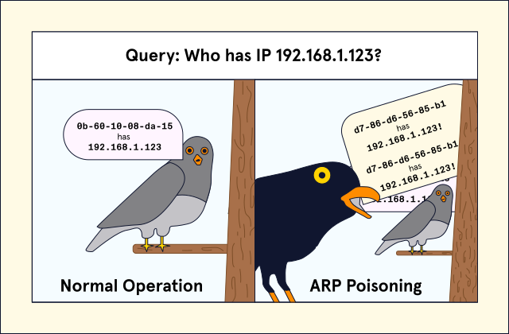

# TP3 : 32°13'34"N 95°03'27"W

Un TP3 plutôt court dédié au protocole ARP.


## Sommaire

- [TP3 : 32°13'34"N 95°03'27"W](#tp3--321334n-950327w)
  - [Sommaire](#sommaire)
- [0. Prérequis](#0-prérequis)
- [I. ARP basics](#i-arp-basics)
- [II. ARP dans un réseau local](#ii-arp-dans-un-réseau-local)
  - [1. Basics](#1-basics)
  - [2. ARP](#2-arp)
  - [3. Bonus : ARP poisoning](#3-bonus--arp-poisoning)

# 0. Prérequis

- **tout se fait en ligne de commande**, sauf si c'est explicitement précisément autrement
- je tente un truc risqué, ceux du matin, vous servez de crash test
  - **vous allez utiliser vos partages de co dans la partie II**
  - **partie II qui se fait à 3 ou 4** (pas + SVP, c'est déjà le cirque à 4)
  - si ça fonctionne pas ce sera backup plan avec les câbles :

# I. ARP basics

> ⚠️ **Pas besoin du partage de co pour le moment, restez sur le réseau de l'école en WiFi.**

☀️ **Avant de continuer...**

- affichez l'adresse MAC de votre carte WiFi !:
```powershell
C:\Users\Ulyss_zi>ipconfig /all
Carte réseau sans fil Wi-Fi :
   Adresse physique . . . . . . . . . . . : 90-09-DF-A4-67-21
```
☀️ **Affichez votre table ARP**

- allez vous commencez à devenir grands, je vous donne pas la commande, demande à m'sieur internet !
```powershell

C:\Users\Ulyss_zi>arp -a

Interface : 192.168.143.1 --- 0x3
  Adresse Internet      Adresse physique      Type
  192.168.143.255       ff-ff-ff-ff-ff-ff     statique
  224.0.0.22            01-00-5e-00-00-16     statique
  224.0.0.251           01-00-5e-00-00-fb     statique
  224.0.0.252           01-00-5e-00-00-fc     statique
  239.255.255.250       01-00-5e-7f-ff-fa     statique

Interface : 192.168.117.1 --- 0x7
  Adresse Internet      Adresse physique      Type
  192.168.117.255       ff-ff-ff-ff-ff-ff     statique
  224.0.0.22            01-00-5e-00-00-16     statique
  224.0.0.251           01-00-5e-00-00-fb     statique
  224.0.0.252           01-00-5e-00-00-fc     statique
  239.255.255.250       01-00-5e-7f-ff-fa     statique

Interface : 192.168.1.189 --- 0xa
  Adresse Internet      Adresse physique      Type
  192.168.1.254         38-07-16-21-8b-47     dynamique
  192.168.1.255         ff-ff-ff-ff-ff-ff     statique
  224.0.0.22            01-00-5e-00-00-16     statique
  224.0.0.251           01-00-5e-00-00-fb     statique
  224.0.0.252           01-00-5e-00-00-fc     statique
  239.255.255.250       01-00-5e-7f-ff-fa     statique
  255.255.255.255       ff-ff-ff-ff-ff-ff     statique

Interface : 192.168.106.1 --- 0xb
  Adresse Internet      Adresse physique      Type
  192.168.106.255       ff-ff-ff-ff-ff-ff     statique
  224.0.0.22            01-00-5e-00-00-16     statique
  224.0.0.251           01-00-5e-00-00-fb     statique
  224.0.0.252           01-00-5e-00-00-fc     statique
  239.255.255.250       01-00-5e-7f-ff-fa     statique

Interface : 192.168.76.1 --- 0xe
  Adresse Internet      Adresse physique      Type
  192.168.76.255        ff-ff-ff-ff-ff-ff     statique
  224.0.0.22            01-00-5e-00-00-16     statique
  224.0.0.251           01-00-5e-00-00-fb     statique
  224.0.0.252           01-00-5e-00-00-fc     statique
  239.255.255.250       01-00-5e-7f-ff-fa     statique

Interface : 192.168.43.1 --- 0x14
  Adresse Internet      Adresse physique      Type
  192.168.43.255        ff-ff-ff-ff-ff-ff     statique
  224.0.0.22            01-00-5e-00-00-16     statique
  224.0.0.251           01-00-5e-00-00-fb     statique
  224.0.0.252           01-00-5e-00-00-fc     statique
  239.255.255.250       01-00-5e-7f-ff-fa     statique

Interface : 192.168.232.1 --- 0x15
  Adresse Internet      Adresse physique      Type
  192.168.232.255       ff-ff-ff-ff-ff-ff     statique
  224.0.0.22            01-00-5e-00-00-16     statique
  224.0.0.251           01-00-5e-00-00-fb     statique
  224.0.0.252           01-00-5e-00-00-fc     statique
  239.255.255.250       01-00-5e-7f-ff-fa     statique

Interface : 192.168.40.1 --- 0x18
  Adresse Internet      Adresse physique      Type
  192.168.40.255        ff-ff-ff-ff-ff-ff     statique
  224.0.0.22            01-00-5e-00-00-16     statique
  224.0.0.251           01-00-5e-00-00-fb     statique
  224.0.0.252           01-00-5e-00-00-fc     statique
  239.255.255.250       01-00-5e-7f-ff-fa     statique

Interface : 10.7.1.1 --- 0x1e
  Adresse Internet      Adresse physique      Type
  10.7.1.255            ff-ff-ff-ff-ff-ff     statique
  224.0.0.22            01-00-5e-00-00-16     statique
  224.0.0.251           01-00-5e-00-00-fb     statique
  224.0.0.252           01-00-5e-00-00-fc     statique
  239.255.255.250       01-00-5e-7f-ff-fa     statique

  ```


☀️ **Déterminez l'adresse MAC de la passerelle du réseau de l'école**

- la passerelle, vous connaissez son adresse IP normalement (cf TP1 ;) )
- si vous avez un accès internet, votre PC a forcément l'adresse MAC de la passerelle dans sa table ARP:
``` powershell
  C:\Users\Ulyss_zi>arp -a | find "192.168.1.254"
    192.168.1.254         38-07-16-21-8b-47     dynamique
```
☀️ **Supprimez la ligne qui concerne la passerelle**

- une commande pour supprimer l'adresse MAC de votre table ARP
- si vous ré-affichez votre table ARP, y'a des chances que ça revienne presque tout de suite !

☀️ **Prouvez que vous avez supprimé la ligne dans la table ARP**

- en affichant la table ARP
- si la ligne est déjà revenue, déconnecte-toi temporairement du réseau de l'école, et supprime-la de nouveau
```powershell
C:\Users\Ulyss_zi>arp -a | find /V " 192.168.1.254"

Interface : 192.168.143.1 --- 0x3
  Adresse Internet      Adresse physique      Type
  192.168.143.255       ff-ff-ff-ff-ff-ff     statique
  224.0.0.22            01-00-5e-00-00-16     statique
  224.0.0.251           01-00-5e-00-00-fb     statique
  224.0.0.252           01-00-5e-00-00-fc     statique
  239.255.255.250       01-00-5e-7f-ff-fa     statique

Interface : 192.168.117.1 --- 0x7
  Adresse Internet      Adresse physique      Type
  192.168.117.255       ff-ff-ff-ff-ff-ff     statique
  224.0.0.22            01-00-5e-00-00-16     statique
  224.0.0.251           01-00-5e-00-00-fb     statique
  224.0.0.252           01-00-5e-00-00-fc     statique
  239.255.255.250       01-00-5e-7f-ff-fa     statique

Interface : 192.168.1.189 --- 0xa
  Adresse Internet      Adresse physique      Type
  192.168.1.255         ff-ff-ff-ff-ff-ff     statique
  224.0.0.22            01-00-5e-00-00-16     statique
  224.0.0.251           01-00-5e-00-00-fb     statique
  224.0.0.252           01-00-5e-00-00-fc     statique
  239.255.255.250       01-00-5e-7f-ff-fa     statique
  255.255.255.255       ff-ff-ff-ff-ff-ff     statique

Interface : 192.168.106.1 --- 0xb
  Adresse Internet      Adresse physique      Type
  192.168.106.255       ff-ff-ff-ff-ff-ff     statique
  224.0.0.22            01-00-5e-00-00-16     statique
  224.0.0.251           01-00-5e-00-00-fb     statique
  224.0.0.252           01-00-5e-00-00-fc     statique
  239.255.255.250       01-00-5e-7f-ff-fa     statique

Interface : 192.168.76.1 --- 0xe
  Adresse Internet      Adresse physique      Type
  192.168.76.255        ff-ff-ff-ff-ff-ff     statique
  224.0.0.22            01-00-5e-00-00-16     statique
  224.0.0.251           01-00-5e-00-00-fb     statique
  224.0.0.252           01-00-5e-00-00-fc     statique
  239.255.255.250       01-00-5e-7f-ff-fa     statique

Interface : 192.168.43.1 --- 0x14
  Adresse Internet      Adresse physique      Type
  192.168.43.255        ff-ff-ff-ff-ff-ff     statique
  224.0.0.22            01-00-5e-00-00-16     statique
  224.0.0.251           01-00-5e-00-00-fb     statique
  224.0.0.252           01-00-5e-00-00-fc     statique
  239.255.255.250       01-00-5e-7f-ff-fa     statique

Interface : 192.168.232.1 --- 0x15
  Adresse Internet      Adresse physique      Type
  192.168.232.255       ff-ff-ff-ff-ff-ff     statique
  224.0.0.22            01-00-5e-00-00-16     statique
  224.0.0.251           01-00-5e-00-00-fb     statique
  224.0.0.252           01-00-5e-00-00-fc     statique
  239.255.255.250       01-00-5e-7f-ff-fa     statique

Interface : 192.168.40.1 --- 0x18
  Adresse Internet      Adresse physique      Type
  192.168.40.255        ff-ff-ff-ff-ff-ff     statique
  224.0.0.22            01-00-5e-00-00-16     statique
  224.0.0.251           01-00-5e-00-00-fb     statique
  224.0.0.252           01-00-5e-00-00-fc     statique
  239.255.255.250       01-00-5e-7f-ff-fa     statique

Interface : 10.7.1.1 --- 0x1e
  Adresse Internet      Adresse physique      Type
  10.7.1.255            ff-ff-ff-ff-ff-ff     statique
  224.0.0.22            01-00-5e-00-00-16     statique
  224.0.0.251           01-00-5e-00-00-fb     statique
  224.0.0.252           01-00-5e-00-00-fc     statique
  239.255.255.250       01-00-5e-7f-ff-fa     statique
```
☀️ **Wireshark**

- capture `arp1.pcap`
- lancez une capture Wireshark, puis supprimez la ligne de la passerelle dans la table ARP pendant que la capture est en cours
- la capture doit contenir uniquement 2 trames :
  - un ARP request que votre PC envoie pour apprendre l'adresse MAC de la passerelle
  - et la réponse

> *Si vous les voyez pas, ça veut dire que votre PC n'utilise pas du tout de connexion vers l'extérieur, genre vers internet. Ce qui paraît invraisemblable on est d'accord non ? Vous avez vu ce que ça fait avec `netstat` aux TPs précédents quand on affiche toutes les connexions réseau en cours ! Très peu de chance que votre PC ne contacte pas internet toutes les quelques secondes.*

# II. ARP dans un réseau local

> ⚠️ **Avant de continuer, regroupez-vous par 3 ou 4, et connectez-vous au même partage de co avec le téléphone de l'un d'entre vous.** Si ça fonctionne pas, vous pouvez faire cette partie sur le réseau de l'école mais moins bieng.

Dans cette situation, le téléphone agit comme une "box" :

- **c'est un switch**
  - il permet à tout le monde d'être connecté à un même réseau local
- **c'est aussi un routeur**
  - il fait passer les paquets du réseau local, à internet
  - et vice-versa
  - on dit que ce routeur est la **passerelle** du réseau local

## 1. Basics

> ⚠️ **Avant de continuer, regroupez-vous par 3 ou 4, et connectez-vous au même partage de co avec le téléphone de l'un d'entre vous.** Si ça fonctionne pas, vous pouvez faire cette partie sur le réseau de l'école mais moins bieng.

☀️ **Déterminer**

- pour la carte réseau impliquée dans le partage de connexion (carte WiFi ?)
- son adresse IP au sein du réseau local formé par le partage de co
- son adresse MAC: 

``` powershell
  C:\Users\Ulyss_zi>ipconfig

Configuration IP de Windows:
  Passerelle par défaut. . . . . . . . . : fe80::c8b1:cdff:fed2:cf64%10
                                       172.20.10.1
```

☀️ **DIY**

- changer d'adresse IP
  - vous pouvez le faire en interface graphique
- faut procéder comme au TP1 :
  - vous respectez les informations que vous connaissez du réseau
  - remettez la même passerelle, le même masque, et le même serveur DNS
  - changez seulement votre adresse IP, ne changez que le dernier nombre
- prouvez que vous avez bien changé d'IP
  - avec une commande !:

  ```powershell
  C:\Users\Ulyss_zi>ipconfig
  Configuration IP de Windows

  Carte réseau sans fil Wi-Fi :

    Suffixe DNS propre à la connexion. . . :
    Adresse IPv6. . . . . . . . . . . . . .: 2a01:cb01:302e:8a58:fdce:4995:8394:9239
    Adresse IPv6 temporaire . . . . . . . .: 2a01:cb01:302e:8a58:112d:500c:de6d:cd9e
    Adresse IPv6 de liaison locale. . . . .: fe80::ec2f:6aee:58bf:efea%10
    Adresse IPv4. . . . . . . . . . . . . .: 172.20.10.2
    Masque de sous-réseau. . . . . . . . . : 255.255.255.240
    Passerelle par défaut. . . . . . . . . : fe80::c8b1:cdff:fed2:cf64%10
                                        172.20.10.1

  Carte Ethernet Connexion réseau Bluetooth :

    Statut du média. . . . . . . . . . . . : Média déconnecté
    Suffixe DNS propre à la connexion. . . :
    ```
devien  après changement devinet 

```powershell
C:\Users\Ulyss_zi>ipconfig
Configuration IP de Windows

Carte réseau sans fil Wi-Fi :

   Suffixe DNS propre à la connexion. . . :
   Adresse IPv6. . . . . . . . . . . . . .: 2a01:cb01:302e:8a58:fdce:4995:8394:9239
   Adresse IPv6 temporaire . . . . . . . .: 2a01:cb01:302e:8a58:112d:500c:de6d:cd9e
   Adresse IPv6 de liaison locale. . . . .: fe80::ec2f:6aee:58bf:efea%10
   Adresse IPv4. . . . . . . . . . . . . .: 172.32.54.98
   Masque de sous-réseau. . . . . . . . . : 255.255.255.240
   Passerelle par défaut. . . . . . . . . : fe80::c8b1:cdff:fed2:cf64%10
                                       172.20.10.1

Carte Ethernet Connexion réseau Bluetooth :

   Statut du média. . . . . . . . . . . . : Média déconnecté
   Suffixe DNS propre à la connexion. . . :
```


☀️ **Pingz !**

- vérifiez que vous pouvez tous vous `ping` avec ces adresses IP
- vérifiez avec une commande `ping` que vous avez bien un accès internet

> *Pour vérifier l'accès internet avec un `ping` il suffit d'envoyer un `ping` vers une adresse IP publique ou un nom de domaine public que vous connaissez. Genre `ping xkcd.com`, ça fonctionne, peu importe, du moment que c'est sur internet.*

## 2. ARP

☀️ **Affichez votre table ARP !**

- normalement, après les `ping`, vous avez appris l'adresse MAC de tous les autres:
```powershell
C:\Users\Ulyss_zi>arp -a

Interface : 192.168.143.1 --- 0x3
  Adresse Internet      Adresse physique      Type
  224.0.0.22            01-00-5e-00-00-16     statique

Interface : 192.168.117.1 --- 0x7
  Adresse Internet      Adresse physique      Type
  224.0.0.22            01-00-5e-00-00-16     statique

Interface : 172.20.10.5 --- 0xa
  Adresse Internet      Adresse physique      Type
  172.20.10.1           ca-b1-cd-d2-cf-64     dynamique
  224.0.0.22            01-00-5e-00-00-16     statique

Interface : 192.168.106.1 --- 0xb
  Adresse Internet      Adresse physique      Type
  224.0.0.22            01-00-5e-00-00-16     statique

Interface : 192.168.76.1 --- 0xe
  Adresse Internet      Adresse physique      Type
  224.0.0.22            01-00-5e-00-00-16     statique

Interface : 192.168.43.1 --- 0x14
  Adresse Internet      Adresse physique      Type
  224.0.0.22            01-00-5e-00-00-16     statique

Interface : 192.168.232.1 --- 0x15
  Adresse Internet      Adresse physique      Type
  224.0.0.22            01-00-5e-00-00-16     statique

Interface : 192.168.40.1 --- 0x18
  Adresse Internet      Adresse physique      Type
  224.0.0.22            01-00-5e-00-00-16     statique

Interface : 10.7.1.1 --- 0x1e
  Adresse Internet      Adresse physique      Type
  224.0.0.22            01-00-5e-00-00-16     statique
```


➜ **Wireshark that**

- lancez tous Wireshark
- videz tous vos tables ARP
- normalement, y'a ~~presque~~ pas de raisons que vos PCs se contactent entre eux spontanément donc les tables ARP devraient rester vides tant que vous faites rien
- à tour de rôle, envoyez quelques `ping` entre vous
- constatez les messages ARP spontanés qui précèdent vos `ping`
  - ARP request
    - envoyé en broadcast `ff:ff:ff:ff:ff:ff`
    - tout le monde les reçoit donc !
  - ARP reply
    - celui qui a été `ping` répond à celui qui a initié le `pingv
    - il l'informe que l'adresse IP qui a été `ping` correspond à son adresse MAC

☀️ **Capture arp2.pcap**

- ne contient que des ARP request et ARP reply
- contient tout le nécessaire pour que votre table ARP soit populée avec l'adresse MAC de tout le monde

## 3. Bonus : ARP poisoning



> ⚠️⚠️⚠️ Si le partage de co n'a pas fonctionné, **il est hors de question que vous fassiez ça sur le réseau de l'école. Donc partage de co ou avec des VMs.**

⭐ **Empoisonner la table ARP de l'un des membres de votre réseau**

- il faut donc forcer l'injection de fausses informations dans la table ARP de quelqu'un d'autre
- on peut le faire en envoyant des messages ARP que l'on a forgé nous-mêmes
- avec quelques lignes de code, ou y'a déjà ce qu'il faut sur internet
- faites vos recherches, demandez-moi si vous voulez de l'aide
- affichez la table ARP de la victime une fois modifiée dans le compte-rendu

⭐ **Mettre en place un MITM**

- MITM pour Man-in-the-middle
- placez vous entre l'un des membres du réseau, et la passerelle
- ainsi, dès que ce PC va sur internet, c'est à vous qu'il envoie tous ses messages
- pour ça, il faut continuellement empoisonner la table ARP de la victime, et celle de la passerelle

> Au moins tous ceux veulent faire de la sécu, il faudrait faire cette partie bonus ! Prenez-vous un peu la tête pour le réaliser, avec des VMs y'aura ptet moins de trucs dans tous les sens pour une première fois. Hésitez pas à m'appeler.

