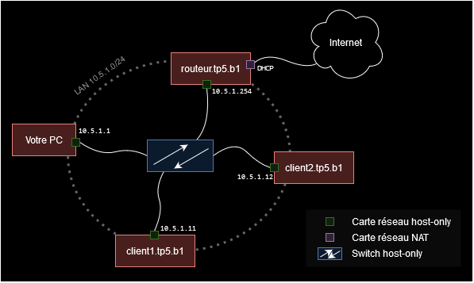

# TP5 : Un ptit LAN à nous

Premier TP avec des machines virtuelles ! C'est ce qu'on va avoir de mieux pour connecter plusieurs machines dans un réseau local (LAN en anglais), en maîtrisant tout ce qu'il se passe dans ce LAN.

**Ce qu'il y a de plus pratique pour tester des machins !** Habituez-vous :d

> *On ne sera donc pas tributaire d'un équipement un peu "boîte noire" comme dans les TPs précédents : on dépendait toujours de votre partage de co, du routeur de YNOV ou de chez vous, etc.*


## Sommaire

- [TP5 : Un ptit LAN à nous](#tp5--un-ptit-lan-à-nous)
  - [Sommaire](#sommaire)
- [0. Prérequis](#0-prérequis)
- [I. Setup](#i-setup)
- [II. Accès internet pour tous](#ii-accès-internet-pour-tous)
  - [1. Accès internet routeur](#1-accès-internet-routeur)
  - [2. Accès internet clients](#2-accès-internet-clients)
- [III. Serveur SSH](#iii-serveur-ssh)
- [IV. Serveur DHCP](#iv-serveur-dhcp)
  - [1. Le but](#1-le-but)
  - [2. Comment le faire](#2-comment-le-faire)
  - [3. Rendu attendu](#3-rendu-attendu)
    - [A. Installation et configuration du serveur DHCP](#a-installation-et-configuration-du-serveur-dhcp)
    - [B. Test avec un nouveau client](#b-test-avec-un-nouveau-client)
    - [C. Consulter le bail DHCP](#c-consulter-le-bail-dhcp)
- [Bonus](#bonus)

# 0. Prérequis

➜ **une machine Rocky Linux prête à être clonée**

- on s'en servira pour tout ce qui est routeur/serveur etc.
- pour les ressources, on peut aller sur quelque chose de minimal ça fonctionnera très bien :
  - 1 CPU
  - 1 ou 2G de RAM
- **au moment de cloner, indiquez bien que vous voulez regénérer de nouvelles adresses MAC**

➜ **votre machine Ubuntu prête à être clonée**

- celle que vous avez créée dans un précédent cours, que j'ai vu sur vos PCs
- on s'en servira comme client
- idem, inutile de donner trop de ressources
  - 1-4G de RAM vu que c'est un OS avec une interface graphique
  - mémoire vidéo à fond (128M)
  - 1 CPU ou 2
- **au moment de cloner, indiquez bien que vous voulez regénérer de nouvelles adresses MAC**

➜ **Munissez-vous des ptits mémos que je vous ai préparés :d**

- pour toutes les configurations à effectuer, je vous file toutes les commandes/syntaxes/fichiers etc.
  - [pour les machines Ubuntu c'est ici](../../cours/memo/ubuntu.md)
  - [pour Rocky c'est làààà](../../cours/memo/rocky.md)

# I. Setup

➜ **Mettre en place le setup suivant :**



➜ **Ptit tableau avec les adresses IP**

| Nom de la machine | IP dans le LAN `10.5.1.0/24` |
|-------------------|------------------------------|
| Votre PC          | `10.5.1.1`                   |
| `client1.tp5.b1`  | `10.5.1.11`                  |
| `client2.tp5.b1`  | `10.5.1.12`                  |
| `routeur.tp5.b1`  | `10.5.1.254`                 |

> `/24` correspond à un masque de `255.255.255.0`. C'est deux façons différentes d'écrire la même chose, on voit ça bientôt. Il faudra indiquer le même masque à toutes les machines.

➜ **Il faut donc, sur votre PC :**

- créer un host-only (réseau privé-hôte en français)
- définir l'IP `10.5.1.1/24` pour le PC depuis l'interface de VBox
- ajouter les cartes réseau nécessaires à toutes les VMs
  - 1 carte host-only pour les 3 VMs (clients et routeur)
  - 1 carte NAT en + pour le routeur

> *Pour rappel la carte host-only, comme montrée sur le schéma, permet que tout le monde soit connecté à un switch virtuel, et ainsi former un LAN (réseau local). La carte NAT permet uniquement un accès internet.*

➜ **Ensuite, pour chaque VM...**

- **configurer l'adresse IP demandée**
  - ça se fait depuis la VM directement : chaque client choisit sa propre IP comme toujours !
  - mettez l'IP indiquée dans le tableau, et le même masque pour tout le monde
- **configurer un *hostname* pour la VM**
  - comme ça, quand on est dans un terminal, le nom de la machin est affiché, et on sait où on est !
  - c'est affiché dans le prompt dans votre terminal : `[it4@localhost]$`
  - le nom par défaut c'est `localhost` et c'est pourri !

☀️ **Uniquement avec des commandes, prouvez-que :**

- vous avez bien configuré les adresses IP demandées (un `ip a` suffit hein)
- vous avez bien configuré les *hostnames* demandés
- tout le monde peut se ping au sein du réseau `10.5.1.0/24`

🌙 les deux fichier se sont la : [ip du routeur](ip%20du%20routeur%20rocky%20linux%20.png) et [ip des ubuntu](îp%20des%20ubuntu.png) et pour les hostnames les voila : [hostname](hostname%20des%20machine.png)


> *Dès que votre PC peut `ping` tout le monde, je vous conseille **fortement** de vous connecter en SSH à vos VMs. En particulier la VM Rocky qui a déjà un serveur SSH qui tourne par défaut.*

# II. Accès internet pour tous

➜ **Actuellement, tout le monde est connecté, mais les clients n'ont pas internet !**


➜ Dans cette partie, on va faire en sorte que tout le monde ait un accès internet :

- le routeur a déjà un accès internet
- les clients vont se servir du routeur comme passerelle afin d'accéder à internet

Pour ça :

- il faut que notre machine `routeur.tp5.b1` accepte de router des paquets
- il faut que chaque client
  - connaisse `routeur.tp.b1` comme sa passerelle (`10.5.1.254`)
  - connaisse l'adresse d'un serveur DNS (pour résoudre des noms comme `www.ynov.com` afin de connaître l'adresse IP associée à ce nom)

> Si l'un de ces points n'est pas correctement configuré, on est bien "connectés" (genre y'a un LAN, tout le monde se `ping`) mais sans "accès internet".

## 1. Accès internet routeur

> *Cette section 1. est à réaliser sur `routeur.tp5.b1`.

☀️ **Déjà, prouvez que le routeur a un accès internet**

- une seule commande `ping` suffit à prouver ça, vers un nom de domaine que vous connaissez, genre `www.ynov.com` (ou autre de votre choix :d):
```bash
🌙pour rocky linux : 
[root@routeur /]# ping x.com
PING x.com (104.244.42.1) 56(84) bytes of data.
64 bytes from 104.244.42.1 (104.244.42.1): icmp_seq=1 ttl=255 time=35.9 ms
64 bytes from 104.244.42.1 (104.244.42.1): icmp_seq=2 ttl=255 time=26.5 ms
64 bytes from 104.244.42.1 (104.244.42.1): icmp_seq=3 ttl=255 time=30.2 ms
64 bytes from 104.244.42.1 (104.244.42.1): icmp_seq=4 ttl=255 time=29.0 ms
64 bytes from 104.244.42.1 (104.244.42.1): icmp_seq=5 ttl=255 time=27.9 ms
64 bytes from 104.244.42.1 (104.244.42.1): icmp_seq=6 ttl=255 time=24.2 ms
64 bytes from 104.244.42.1 (104.244.42.1): icmp_seq=7 ttl=255 time=25.3 ms
64 bytes from 104.244.42.1 (104.244.42.1): icmp_seq=8 ttl=255 time=25.3 ms
```
🌙pour client1: [clien1](ping%20client1.png)


☀️ **Activez le routage**

- toujours sur `routeur.tp5.b1`
- la commande est dans le mémo toujours !:
🌙

```powershell
[root@routeur /]# sudo firewall-cmd --list-all
public (active)
  target: default
  icmp-block-inversion: no
  interfaces: enp0s3 enp0s8
  sources:
  services: cockpit dhcpv6-client ssh
  ports:
  protocols:
  forward: yes
  masquerade: no
  forward-ports:
  source-ports:
  icmp-blocks:
  rich rules:
[root@routeur /]# sudo firewall-cmd --add-masquerade --permanent
success
[root@routeur /]# sudo firewall-cmd --reload

success
[root@routeur /]#

```


> Tout est normalement déjà setup avec la carte NAT ! Si vous n'avez pas internet, c'est que votre carte NAT est éteinte. Allumez-la !

## 2. Accès internet clients

> *Cette section 2. est à réaliser sur `client1.tp5.b1` et `client2.tp5.b1`. Tout est dans [le mémo réseau Ubuntu](../../cours/memo/ubuntu.md).*

➜ **Définir l'adresse IP du routeur comme passerelle pour les clients**

- il sera peut-être nécessaire de redémarrer l'interface réseau pour que ça prenne effet

➜ **Vérifier que les clients ont un accès internet**

- avec un `ping` vers une adresse IP publique vous connaissez
- à ce stade, vos clients ne peuvent toujours pas résoudre des noms, donc impossible de visiter un site comme `www.ynov.com`

➜ **Définir `1.1.1.1` comme serveur DNS que peuvent utiliser les clients**

- redémarrez l'interface réseau si nécessaire pour que ça prenne effet
- ainsi vos clients pourront spontanément envoyer des requêtes DNS vers `1.1.1.1` afin d'apprendre à quelle IP correspond un nom de domaine donné


> *`1.1.1.1` c'est l'adresse IP publique d'un serveur DNS d'une entreprise qui s'appelle CloudFlare (un gros acteur du Web). Ils hébergent gracieusement et publiquement ce serveur DNS, afin que n'importe qui puisse l'utiliser.*

☀️ **Prouvez que les clients ont un accès internet**

- avec de la résolution de noms cette fois
- une seule commande `ping` suffit

🌙 [voicie le ping de clien tp 2](client%202%20ping.png)

☀️ **Montrez-moi le contenu final du fichier de configuration de l'interface réseau**

- celui de `client2.tp5.b1` me suffira
- pour le compte-rendu, une simple commande `cat` pour afficher le contenu du fichier

> *Vous devriez pouvoir ouvrir un navigateur et visiter des sites sans soucis sur les clients.*

 

# III. Serveur SSH

> *Cette partie III. est à réaliser sur `routeur.tp5.b1`. Tout est dans [le mémo réseau Rocky](../../cours/memo/rocky.md).*

☀️ **Sur `routeur.tp5.b1`, déterminer sur quel port écoute le serveur SSH**

- pour le serveur SSH, le nom du programme c'est `sshd`
  - il écoute sur un port TCP
- dans le compte rendu je veux que vous utilisiez une syntaxe avec `... | grep <PORT>` pour isoler la ligne avec le port intéressant
  - par exemple si, vous repérez le port 8888, vous ajoutez ` | grep 8888` à votre commande, pour me mettre en évidence le por que vous avez repéré

☀️ **Sur `routeur.tp5.b1`, vérifier que ce port est bien ouvert**

- la commande est dans [le mémooooo](../../cours/memo/rocky.md) pour voir la configuration du pare-feu

🌙 j'ai rrgoupé les deux en méme temps


> ***Si vous voyez le "service" `ssh` ouvert dans le pare-feu**, il correspond à un port bien précis. Pour voir la correspondance entre les "services" et le port associé, vous pouvez consulter le contenu du fichier `/etc/services`. Ca devrait correspondre à ce que vous avez vu juste avant !*

➜ Dernière fois que je le dis : **connectez-vous en SSH pour administrer la machine Rocky Linux**, n'utilisez pas l'interface console de VirtualBox.

# IV. Serveur DHCP

## 1. Le but

➜ On installe et configure **notre propre serveur DHCP** dans cette partie ! Le but est le suivant :

- **dès qu'un client se connecte à notre réseau, il a automatiquement internet !**
- ça **évite de faire à la main** comme vous avez fait dans ce TP :
  - choisir et configurer une adresse IP
  - choisir et configurer l'adresse d'un serveur DNS
  - configurer l'adresse de la passerelle
- **dès qu'il se connecte, il essaiera automatiquement de contacter un serveur DHCP**
- **notre serveur DHCP lui proposera alors automatiquement tout le nécessaire pour avoir un accès internet**, à savoir :
  - une adresse IP disponible
  - l'adresse d'un serveur DNS
  - l'adresse de la passerelle du réseau


## 2. Comment le faire

> Cette fois, je vous ré-écris pas tout, je vous laisse chercher sur internet par vous-mêmes "install dhcp server rocky 9", ou vous référer [par exemple à ce lien](https://www.server-world.info/en/note?os=Rocky_Linux_8&p=dhcp&f=1) qui résume très bien la chose.

➜ Peu importe le lien que vous suivez, **les étapes seront les suivantes** :

- installation du paquet qui contient le serveur DHCP
  - commande `dnf install`
- modification de la configuration
  - c'est un fichier texte (comme toujours)
  - donc avec `nano` ou `vim` par exemple
- (re)démarrage du service DHCP
  - avec un `systemctl start`

➜ **Et si ça fonctionne pas, c'est que tu t'es planté dans le fichier de conf, donc tu vas lire pourquoi dans les logs** :

- voir les logs d'erreur
  - avec une commande `journalctl`
  - généralement, il dit clairement l'erreur
- ajustement de la configuration
  - c'est un fichier texte (comme toujours)
  - donc avec `nano` ou `vim` par exemple
- redémarrage du service DHCP
  - avec un `systemctl restart`

> N'hésitez pas, comme d'hab, à m'appeler si vous galérez avec cette section !

## 3. Rendu attendu

> *Vous pouvez éteindre `client1.tp5.b1` et `client2.tp5.b1` pour limiter l'utilisation des ressources hein.*

⚠️⚠️⚠️ **Vous n'avez le droit d'utiliser QUE des lignes que vous comprenez dans le fichier de configuration.** Et pour lesquelles vous avez adapté les valeurs au TP. **Vous devez enlever les lignes de configuration inutiles pour notre TP.**

### A. Installation et configuration du serveur DHCP

> *Cette section A. est à réaliser sur `routeur.tp5.b1`.*

☀️ **Installez et configurez un serveur DHCP sur la machine `routeur.tp5.b1`**

- je veux toutes les commandes réalisées
- et le contenu du fichier de configuration
- le fichier de configuration doit :
  - indiquer qu'on propose aux clients des adresses IP entre `10.5.1.137` et `10.5.1.237`
  - indiquer aux clients que la passerelle dans le réseau ici c'est `10.5.1.254`
  - indiquer aux clients qu'un serveur DNS joignable depuis le réseau c'est `1.1.1.1`

### B. Test avec un nouveau client

> *Cette section B. est à réaliser sur une nouvelle machine Ubuntu fraîchement clonée : `client3.tp5.b1`. Vous pouvez éteindre `client1.tp5.b1` et `client2.tp5.b1` pour économiser des ressources.*

☀️ **Créez une nouvelle machine client `client3.tp5.b1`**

- définissez son *hostname*
- définissez une IP en DHCP
- vérifiez que c'est bien une adresse IP entre `.137` et `.237`
- prouvez qu'il a immédiatement un accès internet

### C. Consulter le bail DHCP

➜ **Côté serveur DHCP, à chaque fois qu'une adresse IP est proposée à quelqu'un, le serveur crée un fichier texte appelé *bail DHCP*** (ou *DHCP lease* en anglais).

Il contient toutes les informations liées à l'échange avec le client, notamment :

- adresse MAC du client qui a demandé l'IP
- adresse IP proposée au client
- heure et date précises de l'échange DHCP
- durée de validité du *bail DHCP*

> *A l'issue de cette durée de validité, le client devra de nouveau contacter le serveur, pour s'assurer que l'adresse IP est toujours libre. Rappelez-vous que DHCP est utilisé partout pour attribuer automatiquement des adresses IP aux clients, à l'école, chez vous, etc. C'est nécessaire que le bail expire pour pas qu'un client qui se connecte une seule fois monopolise à vie une adresse IP.*

☀️ **Consultez le *bail DHCP* qui a été créé pour notre client**

- à faire sur `routeur.tp5.b1`
- toutes les données du serveur DHCP, comme les *baux DHCP*, sont stockés dans le dossier `/var/lib/dhcpd/`
- afficher le contenu du fichier qui contient les *baux DHCP*
- on devrait y voir l'IP qui a été proposée au client, ainsi que son adresse MAC

☀️ **Confirmez qu'il s'agit bien de la bonne adresse MAC**

- à faire sur `client3.tp5.b1`
- consultez l'adresse MAC du client
- on peut consulter les adresses MAC des cartes réseau avec un simple `ip a` 

# Bonus

Deux ptits TP bonus, qui font écho à tout ce qu'on a vu jusqu'à maintenant :

- [DHCP spoofing](./dhcp_spoof.md)
- [Protection face à un bruteforce/flood](./flood_protect.md)
